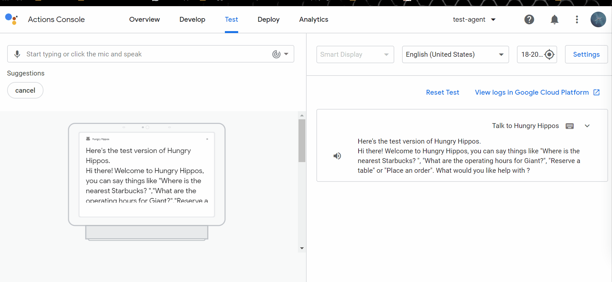
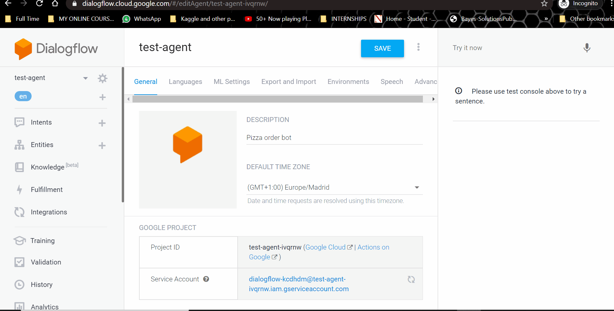
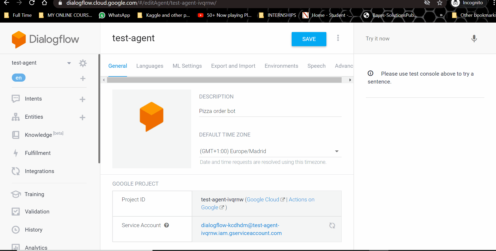
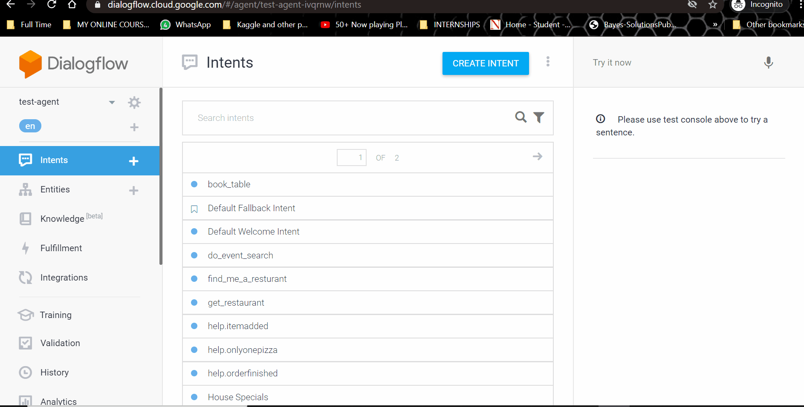
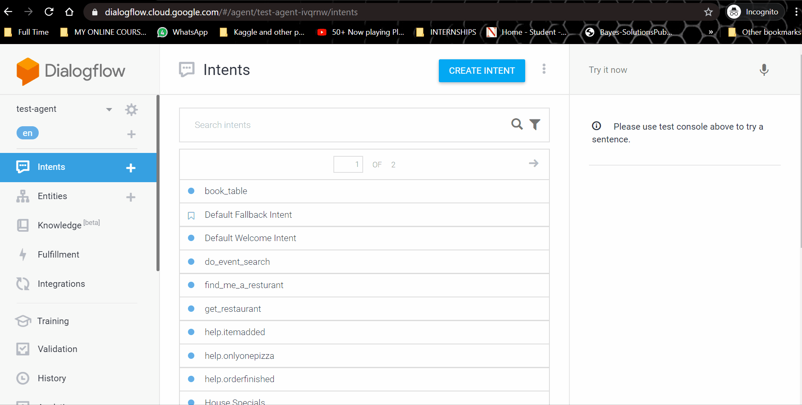

### DS5500 Project 2 : Intent Detection Bot using Dialogflow
##### ***Link for Project Documentation : https://github.com/osnandhu/DS5500_Project_Intent_Detection_Bot_using_Dialogflow/blob/master/DS5500_Project_Documentation.pdf***
##### ***Professor In-Charge: Andrew Therriault***
##### ***Project Partners : Ankit Phaterpekar, Nanditha Sundararajan***

#### INTRODUCTION ####
Conversational bots have many applications throughout the industry today as businesses are looking to take advantage of deploying such services on messaging platforms, voice assistant devices like Google Home, Alexa or customer service bots with the goal of improving user interaction, reducing time or freeing up time taken to service simple tasks.
Our goal was to explore building a task oriented chatbot into an initial minimum viable product that can aid in providing information about business (restaurants, grocery stores, retail stores, pharmacies, etc) from the Yelp directory, such as finding business location, operating hours or notify the user about any nearby events as well as  automate some of the tasks that go into a reservation system or placing an order. We believe collecting feedback on this initial version and future development cycles would lead to a fully fleshed out agent that could be used by Yelp or Opentable for providing alternate ways to engage with the customer in lieu of the traditional website search.
 
  

#### CONFIGURE DIALOGFLOW ####
1. Go to www.dialogflow.com and enter your Gmail credentials  
2. Create an agent in Dialogflow,import the Intent_Detection_Bot/test-agent.zip and enable the beta features as shown above.    
3. The intents, entities will be added automatically after the importation.   
4. Go to fulfillments section and enable Inline Editor. Link the project to your GCP Billing Account Copy and paste the cloud functions codes present in Intent_Detection_Bot/function_source/index.js under index.js and Intent_Detection_Bot/function_source/package.json under package.json and deploy it.   
5. Click on "View execution logs in Google Cloud console". In the Log viewer, we can see the log entries according to our current entries and custom fields represented by a structured JSON and are helpful during Troubleshooting.   

The Cloud Functions in GCP serve as a connecting layer allowing us to weave logic between GCP services by listening for and responding to events. From the above gif, we can see that the Firebase fulfillment functions(index.json and package.json). It could be seen as a platform for Testing the cloud functions and to view logs. 

#### INTENTS,ENTITIES AND CONFIDENCE INTERVAL ####
1. Consider the intent **search_business** that fetches details about a business given the name and user's location. We can add our own training phrases, map it with custom      entities and save it. 
2. While testing in the Dialogflow console, if the exact training phrase is entered, the intent matching confidence is high whereas, if the user query contains a mistake as shown below, the intent matching confidence is really low which indicates that the intents are poorly matched. The default confidence threshold is 0.3.   

### INTEGRATION OF AGENT WITH GOOGLE ASSISTANT  
a)   
      
    
Our Agent can be integrated with Google Assistant via the one-click integration which will take us to the Actions console. Here, in the Overview, we can see the steps         that needs to followed so that we can test and deploy our agent.
    
b)   
      
    Before publishing our agent, we need to provide information about our Actions.  
     a) Directory Information : Promotes and highlights our Action's capabilities and provides everything a user has to know about our Action 
     b) Location targeting : Localise our Actions for the Google Assistant to provide customised experience for different languages and locals the users can set on their             devices 
     c) Surface capabilities: Offers control whether or not users can invoke our Action based on the surface they are using.They get an error message if they use an                   unsupported surface/device.  
     d) Release - There are two types of releases available. We have opted to go for a Alpha release as shown in the above gif. Additional Alpha Testers can be added so that         they can access our agent via their personal Google Assistant via smartphones/Google Home etc.
#### NOTE: Testers should provide us with their personal email id so that we can add them as Alpha testers and grant access for testing our Intent Detection Bot. Please email your personal email id to phaterpekar.ankit@gmail.com or os.nandhu@gmail.com  

#### REFERENCES  
1.	https://cloud.google.com/dialogflow/docs  
2.	https://www.coursera.org/learn/conversational-experiences-dialogflow  
3.	https://firebase.google.com/docs/database  
4.	https://www.youtube.com/watch?v=Z3SR3gS8rF4&list=PLJLSPq0cTRmYmsO3kXuN-a2sg3ruoZV6x  
5.	https://javascript.info/  
6.	https://www.yelp.com/fusion  
7.	https://chatbotslife.com/building-chatbots-using-dialogflow-on-google-assistant-for-beginners-1e91cf355abb?gi=7445dfa68548  
8.	https://cogint.ai/3-methods-for-connecting-a-phone-call-to-dialogflow/  
9.	https://comparecamp.com/dialogflow-review-pricing-pros-cons-features/  
10.	https://link.springer.com/chapter/10.1007/978-1-4842-5741-8_2  

